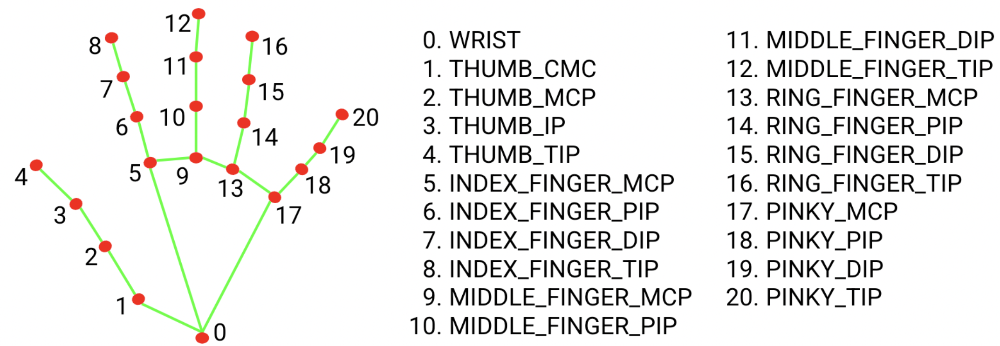

# body_tracker
This project allows to track the face and the hands and also identify some simple gestures

It is based in the examples created by MediaPipe and that can be visited at: https://developers.google.com/mediapipe/solutions

It combines the face recognition along with the gesture recognition. The only thing that you need to do to test it is to set up the python environment and install the libraries. The models are already available in the repository.

python -m pip install mediapipe

The hand landmarker model bundle contains palm detection model and hand landmarks detection model. https://developers.google.com/mediapipe/solutions/vision/gesture_recognizer/index

The gesture classification model bundle can recognize the following hand gestures:
0 - Unrecognized gesture, label: Unknown
1 - Closed fist, label: Closed_Fist
2 - Open palm, label: Open_Palm
3 - Pointing up, label: Pointing_Up
4 - Thumbs down, label: Thumb_Down
5 - Thumbs up, label: Thumb_Up
6 - Victory, label: Victory
7 - Love, label: ILoveYou

The Face Detector returns a FaceDetectorResult object for each detection run. The result object contains bounding boxes for the detected faces and a confidence score for each detected face. https://developers.google.com/mediapipe/solutions/vision/face_detector/python